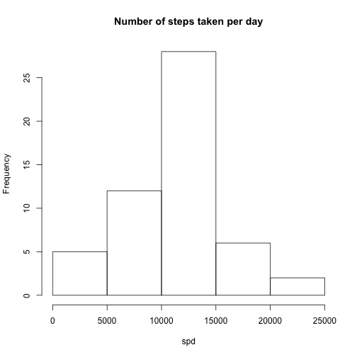
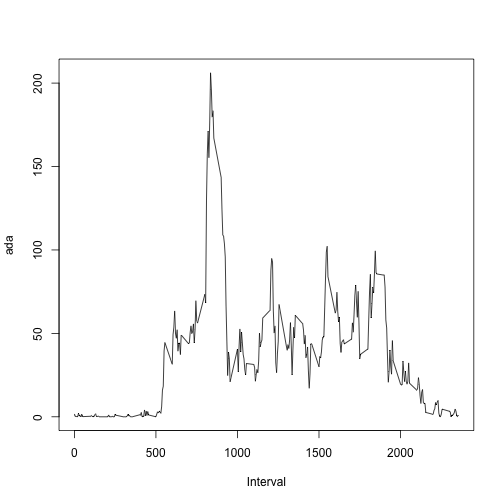
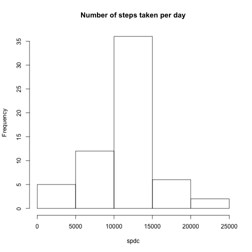
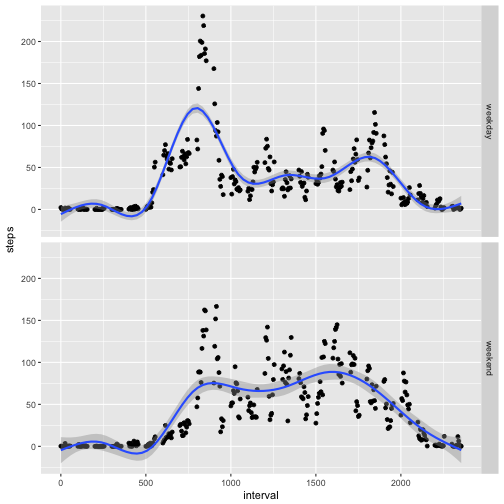

First reading the data in


```r
d <- read.csv("activity.csv")
```

### Total number of steps per day. Calculating the total number per day using tapply, then plotting a histogram and calculating the mean.

```r
spd <- tapply(d$steps,d$date,sum)
hist(spd, main="Number of steps taken per day")
```



```r
mean(spd,na.rm=TRUE)
```

```
## [1] 10766.19
```

```r
median(spd,na.rm=TRUE)
```

```
## [1] 10765
```

### Average daily activity pattern.
Calculating the means for each inerval and then plotting. Also subsetting the interval with the largest mean.


```r
ada <- tapply(d$steps,d$interval,mean,na.rm=TRUE)
plot(names(ada),ada,type = "l",xlab="Interval")
```



```r
ada[ada=max(ada)]
```

```
##     1705 
## 56.30189
```
The interval 1705 on average across all the days in the dataset, contains the maximum number of steps.

### Imputing missing values.

Counting the number of NAs

```r
sum(!complete.cases(d))
```

```
## [1] 2304
```

The total number of repws with NAs = 2304.

I have decided to impute missing values with the mean of that 5 minute interval.


```r
dc <- d
dc$steps[is.na(dc$steps)] = ave(dc$steps, 
                           dc$interval, 
                             FUN=function(x)mean(x, 
                      na.rm = T))[is.na(d$steps)] 
```
The code above code does that

Histogram of total number of steps each day with missing data imputed. Using the same strategy as was used for the previous histogram. Getting the mean and median as well.

```r
spdc <- tapply(dc$steps,dc$date,sum)
hist(spdc, main="Number of steps taken per day")
```



```r
mean(spdc)
```

```
## [1] 10766.19
```

```r
median(spdc)
```

```
## [1] 10766.19
```

The means of the imputed and non imputed datasets are the same, showing that imputing does not have an effect, however the median is smaller in the non imputed data. 

### Are there differences in activity patterns between weekdays and weekends
Creating a new factor variable in the dataset with two levels – “weekday” and “weekend” indicating whether a given date is a weekday or weekend day.

```r
dc$date <- as.Date(dc$date)
dc$day <- ifelse(weekdays(dc$date)=="Saturday","weekend","")
dc$day <- ifelse(weekdays(dc$date)=="Sunday","weekend",dc$day)
dc$day <- ifelse(dc$day=="","weekday",dc$day)
dc$day <- as.factor(dc$day)
```

Creating a plot with average over weekday/weekend

```r
library(ggplot2)
dc$interval <- as.integer(dc$interval)
ggplot(dc, aes(x=interval, y=steps)) + stat_summary(fun.y="mean", geom="point") + geom_smooth()+ facet_grid(day~.)
```

```
## `geom_smooth()` using method = 'gam'
```


